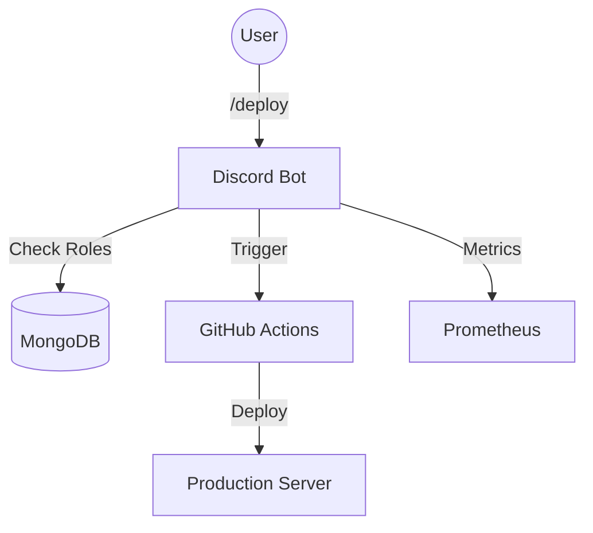

# 🤖 ChatOps Bot (Discord + GitHub + MongoDB)

[](https://github.com/Sandilya69/chatops-bot/actions/workflows/deploy.yml)


A professional, enterprise-grade ChatOps platform for DevOps automation. Built with Node.js, this bot allows teams to deploy code, audit releases, and manage permissions correctly from Discord.

---

## 🚀 Key Features

### 的核心 Core Capabilities

- **Deployments:** Trigger GitHub Actions workflows via `/deploy`.
- **Audit Trails:** Complete history of _who_ deployed _what_ and _when_ (/audit).
- **Security (RBAC):** Granular permissions (Admin/Developer) with approval controls for Production.
- **Traceability:** Fetches and displays GitHub commit metadata before deploying.

### 🏆 Expert-Level Features

- **🧪 Automated Testing:** Comprehensive Jest test suite with API mocking.
- **📊 Observability:** Prometheus metrics endpoint on port 9090.
- **📝 Structured Logging:** JSON logging (Winston) for enterprise log aggregation.
- **🐳 Containerization:** Production-ready Docker support.

---

## 🛠️ Architecture



---

## 🧪 Automated Testing

This project uses **Jest** for unit and integration testing.

```bash
# Run all tests
npm test
```

The test suite includes:

- **Mocking:** GitHub API, Discord Interactions, and MongoDB models are mocked.
- **Security Verification:** Ensures RBAC logic cannot be bypassed.
- **ESM Support:** Uses advanced Jest configuration for ECMAScript Modules.

---

## 📊 Monitoring & Metrics

The bot exposes a Prometheus-compatible metrics endpoint.

- **URL:** `http://localhost:9090/metrics`
- **Port:** `9090` (Separate from bot logic)

**Available Metrics:**

- `chatops_deployments_total`: Total deployments triggered.
- `chatops_deployment_duration_seconds`: Histogram of deployment times.
- `chatops_active_deployments`: Live gauge of in-progress operations.

---

## 📝 Logging

Structured logging is implemented using **Winston**.

- **Development:** Pretty-printed logs in console.
- **Production:** JSON-formatted logs for ingestion (Splunk/ELK).
- **Log Location:** `logs/combined.log` and `logs/error.log`.

---

## 🐳 Docker Deployment

### Quick Start

```bash
# Start bot and metrics server
docker-compose up -d

# View logs
docker-compose logs -f
```

See [DOCKER_GUIDE.md](DOCKER_GUIDE.md) for full details.

---

## 💬 Slash Commands

| Command      | Description                                             | Permission                         |
| ------------ | ------------------------------------------------------- | ---------------------------------- |
| `/deploy`    | Deploy a service (e.g., `api`) to an env (e.g., `prod`) | Developer (Staging) / Admin (Prod) |
| `/audit`     | View deployment history                                 | Everyone                           |
| `/status`    | Check deployment status                                 | Everyone                           |
| `/metrics`   | View usage stats                                        | Admin                              |
| `/addrole`   | Grant permissions to users                              | Admin                              |
| `/viewroles` | See all assigned roles                                  | Admin                              |

---

## ⚙️ Configuration

Create `config/local.env`:

```env
DISCORD_TOKEN=your_token
CLIENT_ID=your_id
MONGODB_URI=mongodb+srv://...
GITHUB_TOKEN=your_pat
GITHUB_OWNER=Sandilya69
GITHUB_REPO=chatops-bot
```

---

## 🏆 Project Status

- [x] Core ChatOps Logic
- [x] Docker Containerization
- [x] MongoDB Audit Trail
- [x] Automated Testing (Jest)
- [x] Prometheus Metrics
- [x] Structured Logging

---

## 🏷️ License

MIT © 2025 Rituraj Tripathi
