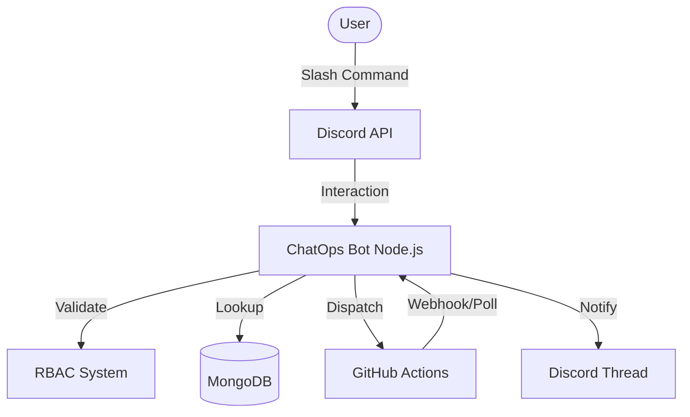

# 🤖 ChatOps Bot (Discord + GitHub + MongoDB)

[](https://github.com/Sandilya69/chatops-bot/actions/workflows/deploy.yml)


A full-stack, enterprise-grade ChatOps automation bot built with Node.js, Discord.js, and MongoDB. It streamlines DevOps tasks directly from Discord, integrating with GitHub Actions for CI/CD with advanced features like multi-repo support, real-time polling, and webhook notifications.

---

## 🚀 Key Features

- **Multi-Repo Support:** Deploy any registered service by looking up repository details in MongoDB.
- **Rollback System:** Quickly revert services to the last known successful version.
- **Real-Time Visibility:** Threaded logs, status polling, and GitHub Webhook integration for live updates.
- **Hardened Security:** RBAC (admin/developer/viewer), production approval flows, and command rate limiting (30s cooldown).
- **Observability:** Prometheus metrics (`/metrics`) and structured audit logging in MongoDB.
- **Reliability:** Automatic MongoDB reconnection logic and API retries with exponential backoff.

---

## 💬 Slash Commands

| Command       | Description                                | Role            |
| ------------- | ------------------------------------------ | --------------- |
| `/ping`       | Health check & latency                     | Everyone        |
| `/deploy`     | Trigger deployment (v4 Polling + Webhooks) | Developer/Admin |
| `/rollback`   | Revert to last successful version (Step 8) | Admin           |
| `/addservice` | Register a new repo/service (Step 9)       | Admin           |
| `/status`     | Check GitHub run status                    | Everyone        |
| `/metrics`    | View performance & success analytics       | Admin           |
| `/audit`      | View recent deployment history             | Admin           |

---

## 🏗️ Architecture



---

## 📁 Structure

```
chatops-bot/
├─ src/
│  ├─ bot.js             # Main entry (Discord + Webhook Server)
│  ├─ commands/          # Slash command handlers
│  │  ├─ deploy.js       # Core deployment logic (Step 4 & 9)
│  │  ├─ rollback.js     # Recovery system (Step 8)
│  │  └─ addservice.js   # Service registration
│  ├─ lib/               # Shared utilities
│  │  ├─ statusPoller.js # GitHub status monitor
│  │  ├─ rateLimiter.js  # Command throttler (Step 6)
│  │  └─ db.js           # Reconnect logic (Step 7)
│  ├─ routes/            # Webhook endpoints
│  │  └─ github.js       # Webhook processor (Step 5)
│  └─ models/            # Mongoose schemas
│     ├─ Service.js      # Multi-repo config
│     └─ ActiveDeploy.js # Deployment tracking
└─ config/local.env      # Configuration
```

---

## 🔧 Setup

1. **Environment:** Create `config/local.env` with:
   - `DISCORD_TOKEN`, `CLIENT_ID`, `MONGODB_URI`, `GITHUB_TOKEN`, `GITHUB_OWNER`.
2. **Commands:** Register slash commands:
   ```bash
   npm run deploy:commands
   ```
3. **Start:**
   ```bash
   npm start
   ```

---

## 🏁 Roadmap

- [x] Multi-repo support
- [x] Webhook integration
- [x] Rollback system
- [ ] PagerDuty/Jira integration
- [ ] Auto-resume end-to-end

---

## 🏷️ License

MIT © 2025 Rituraj Tripathi
